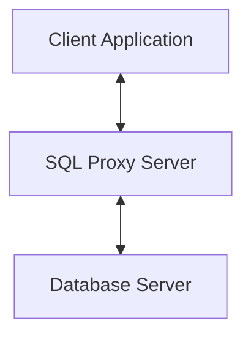

# SQL Proxy Server

## Overview

This program acts as a proxy server that relays and displays SQL queries exchanged between a database server and a client application.

The basic architecture is as follows:

It also includes a feature to count characters within string literals, which can be useful for detecting SQL Injection Attacks (SQLIA).

## Configuration

This program is configured by default for PostgreSQL. The `sockaddr_in` structure is set to use PostgreSQL's default port, `5432`. Please modify this as needed to fit your environment.